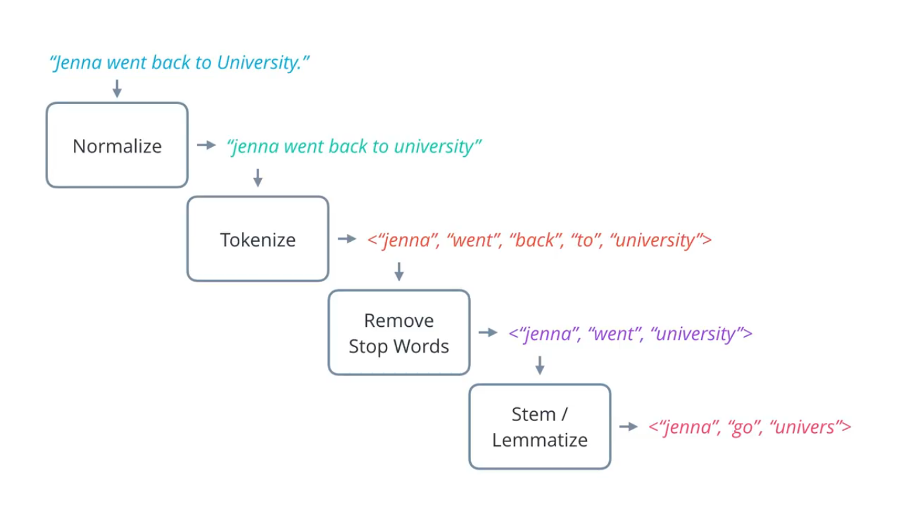
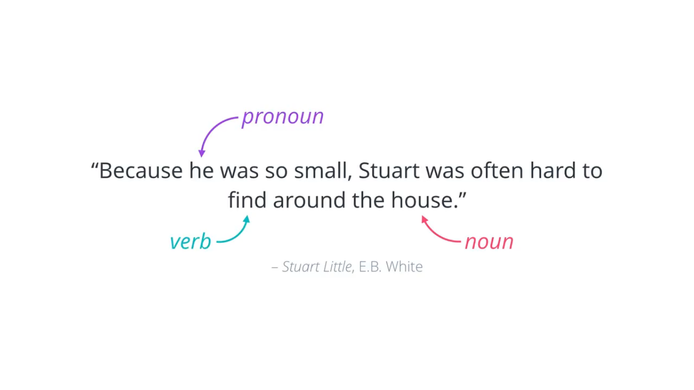
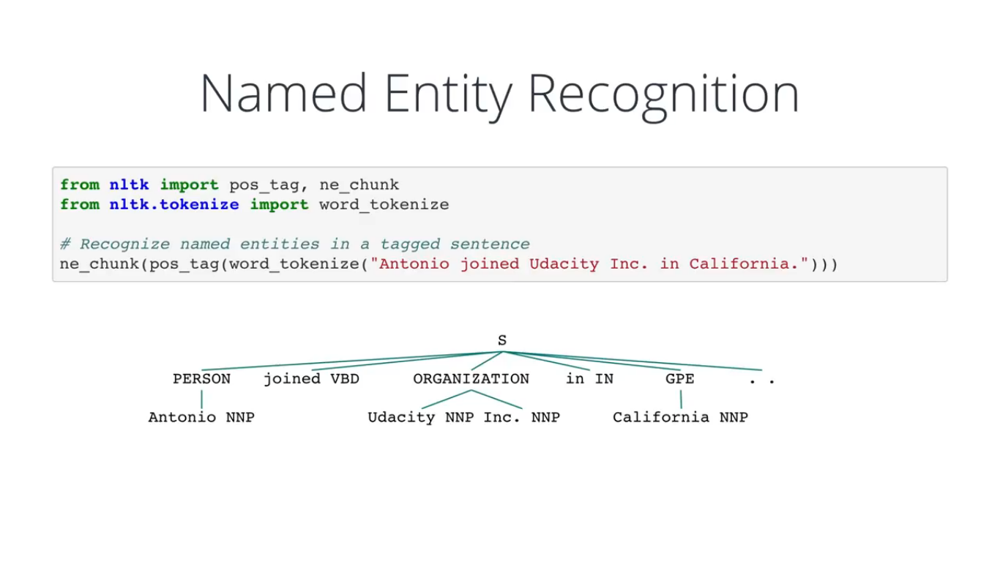
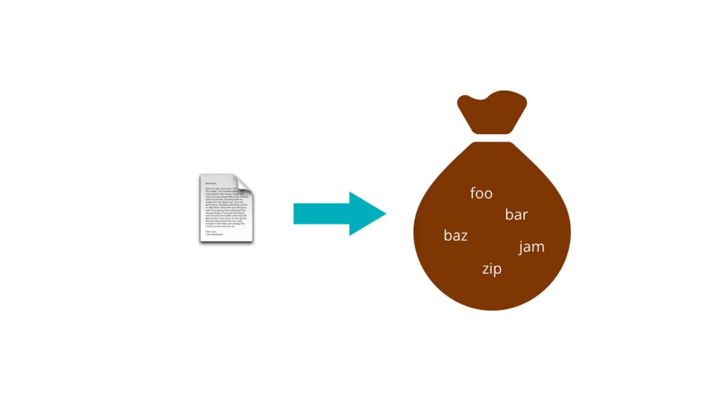
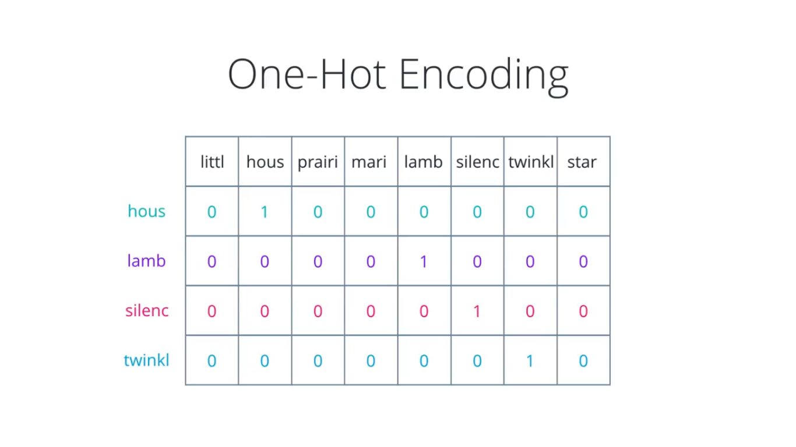
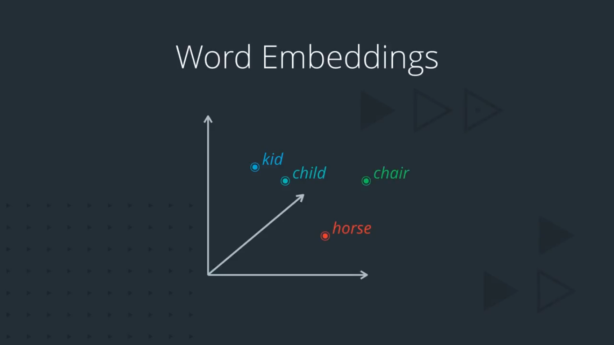
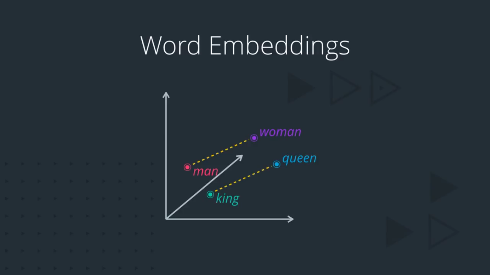
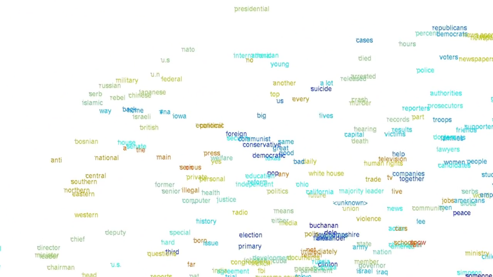

## NLP pipeline

### Text Processing

### Feature Extraction

If graph based model is used to extract insights, words has to be represented like symbolic nodes with relationship between them

#### Word Net

For Statistical Model we have to use numerical representation

For Document Level Task such as Spam detection or sentiment analysis we can use **bag-of-Words** or **doc2vec**

If work is need to done with individual words and phrases such as **text generation** or **machine translation** we need a word level representation such as **word2vec** or **glove**

### Modelling

If numerical representation is done for the text then we can utilize any machine learning model.

### Part of Speech Tagging

**Note**: Part-of-speech tagging using a predefined  grammar like this is a simple, but limited solution. It can be very  tedious and error-prone for a large corpus of text, since you have to  account for all possible sentence structures and tags!

There are other more advanced forms of POS tagging that can learn  sentence structures and tags from given data, including Hidden Markov  Models (HMMs) and Recurrent Neural Networks (RNNs).

### Named Entity Recognition

Named entities are typically noun phrases that refer to some specific objects, places or person etc.

### Bag of Words

The Bag of words model treat each document as an unordered collection of bag of words

Ex- Plagiarism check or sentiment analysis for tweets

Bag of word has a flaw It treats all words equally to solve this problem **TF-IDF** was introduced which solve this problem.

### One-Hot Encoding

One of the way to represent text is using one hot vector

​		

But the problem with one hot vector is The representation size grows with corpus (No of Documents), It does not scale for large corpus for example 50 million vocabulary in corpus will lead each word vector with 50 million values in which all values are zero except one with value one.

### Word Embeddings

What we need to do is to control the size of our word representation by limiting it to fixed size vector.

We want to find an embedding for each word in vector space to which we want them to exhibit certain properties

Two or many words with similar meaning should be together.

If two pairs of word have a similar difference in their meaning they should be equidistant

### t-SNE (t Distributed Stochastic Neighbour Embedding)

Word Embedding need to have higher dimension to capture sufficient variation in natural language which makes the super hard to visualise.

t-SNE is dimensionality reduction technique so it maps higher dimensional vector space to lower dimension vector space preferably 3 dimension or 2 dimension vector space for our visualization purpose. 

This makes t-SNE a good choice for word embedding purpose.

 