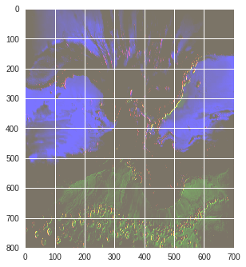
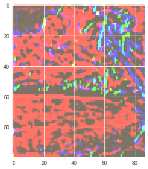
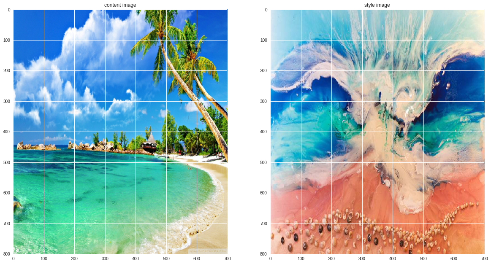
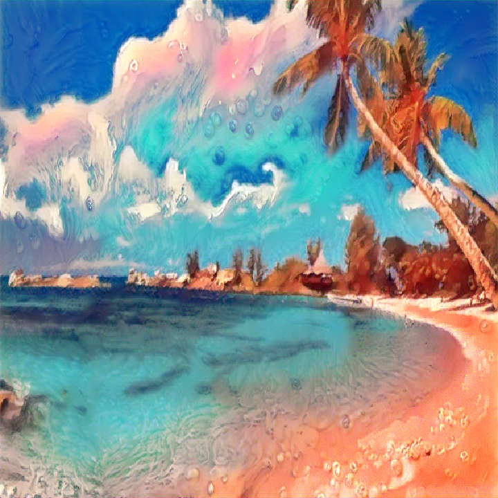
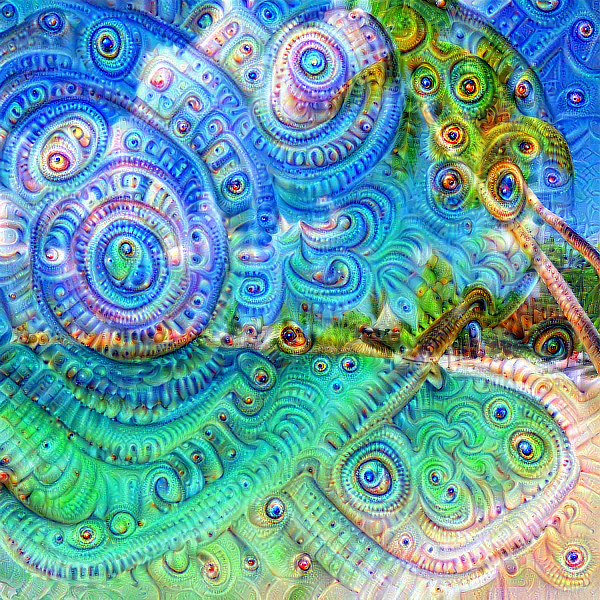
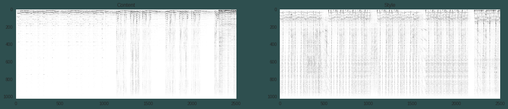
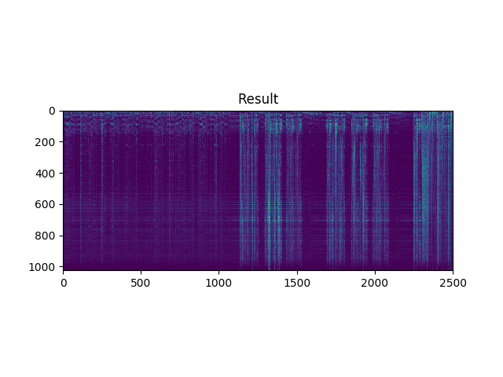

# [Session 1 and 2 ](Session-1 and 2)
The objective of Session 1 will be to get you started with Machine Learning and Deep Learning by  going over the key ideas and concepts required to build any Machine Learning or Deep Learning models.In the session we,will cover several Hands on exercises to resonate to our promise ***Intuition to Implementation*** as it is rightly said by Joel Spolsky :“Its harder to read code than to write it.”

What we will cover:

1. Machine Learning Basics
      * What are Algorithms

      * Bias vs Variance trade off

      * Underfitting, Overfitting

      * Hyperparameters and Validation Sets

      * Gradient Descents

      * Linear Regression

      * Logistic Regression

5. Deep Learning Basics 

      * Neural Networks

      * Backpropagation

      * Activation and Loss Function

      * Optimizers

6. Building Image Classification Model using Keras and Pytorch (MNIST Dataset).

# [Session3](Session3)

Convolution and its concepts 

1. Concept of Convolution
2. Kernel
3. Feature map
4. Stride
5. Padding
6. Max pooling
7. Receptive field
8. Loss functions(Maximum Likelihood,Cross Entropy)

Model Deployment (Hands-on)

1. CNN Model Deployment on the Flask Web Framework.
2. Inferencing the deployed model in Real-time

# [Session4](Session4)

1. Weight Initialization Schemes
2. Regularization and Normalization

    1. L1 Regularization
    2. L2 Regularization
    3. Dropout
    4. Label Smoothing
    5. Batch Normalization
    6. Layer Normalization (Brief)

3. Data Augmentation

4.	Advance CNN Architectures

    1. LeNet
    2. AlexNet
    3. ZfNet
    4. Vgg
    5. ResNet
    6. ResNet Wide
    7. DenseNet 
    8. MobileNet
    9. Inception v1
    10. Inception v2 and v3

5. DenseNet Trained from scratch on cifar 10 dataset both in pytorch and keras.
6. Vgg19 Trained from scratch on cats vs dogs both in pytorch in keras.

# [Session5](Session5)

1. Transfer Learning on ResNet50 Model
2. Creating Your own Dataset from google images(Indian Birds)
3. Transfer Learning Theory and Implementation
4. Lr Scheduler in pytorch
   1. CosineAnnealingLR
   2. LinearScheduler
   3. ExponentialScheduler
   4. CosineScheduler

5. Visualizing The prediction
6. Faster Convergence methodologies
   1. LrFinder Algorithm
   2. SGD with Warm Restarts
   3. One Cycle Policy

7. Model Fine Tuning by using the above techniques
8. Getting Accuracy Results Equivalent to Fast.ai

# [Session6](Session6)

## Feature Map Visualization

## Style Transfer

## Deep Dream

## Neural Style Transfer

